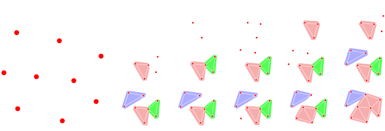

## Want the short version?

Take a look to <a href="../html/hubs" target="_blank">these slides</a>.

## Motivation

Graphs and networks play an essential role in both modern data representation and processing. The topology of these entities encodes essential information, it is enough to think how the performance of an artificial neural network changes according to the organization of the connections between its computing units.

Topological approaches to data representation and in particular persistent homology <a href="https://en.wikipedia.org/wiki/Persistent_homology" target="_blank">(wiki)</a> are nowadays largely used for shape comparison and classification.

What about graphs and networks? Is it possible to build a theory of persistence beyond geometry and topology?

### Topological persistence and data analysis

Topological data analysis <a href="https://en.wikipedia.org/wiki/Topological_data_analysis" target="_blank">(wiki)</a> allows to grasp geometrical and topological features of both manifold and sampled data.

Th image on the left has been taken from <a href="https://aqjaffe.github.io/VRPolygons/index.html" target="_blank">this beautiful post</a>. You can see how it is possible to associate a geometrical entity (a simplicial complex) to a point cloud, by considering the pairwise distances between the points of the cloud. Imagine to center a sphere on each points and make the radius of these spheres grow in time. When two spheres intersect we draw an edge between their centers, a triangle when three spheres intersect.

By looking at the evolution of the construction in the figure, a human observer can easily understand how the points have probably been noisily sampled from a torus (a donut). The construction of the simplicial complex while increasing the radius can be described by considering the variation of the homology groups [(wiki)](https://en.wikipedia.org/wiki/Homology_(mathematics)) of the associated simplicial complex.

By changing the (continuous) function that determines the rule to be followed during the construction of the simplicial complex we can study different geometrical features of a given object (whether sampled or not).

On the right we consider a manifold (a topological sphere) and we study the variation of its topological features when considering the height function. In the previous case we considered the simplicial complex induced by the function measuring the pairwise distance between points. Now, we cut the manifold in nested sublevel sets. For each critical point with respect to the height function (maxima and minima) we will consider the *piece* of manifold under that point, and measure the variation of its homology between sublevel sets. Substantially the green half-line and dots in the diagram count the number of connected components the are born and die (or never die as for the half-line) by rebuilding the topological sphere considering sublevels of the height function. The blue half-line on the top-right corner of the persistence diagram represent the void that is born only when the sphere is closed, i.e. when considering the last non-trivial sub-level of the height function.

###### Topology and graphs

This classical framework can be used to study graphs, by using auxiliary construction, that allow to associate a topological object, such as the simplicial complex in the first figure, with a given graph.
<a href="https://arxiv.org/pdf/1707.09670.pdf" target="_blank">Here</a> we give some basic references and show how different graph-theoretical concepts can be used to fingerprint information from a given network in the classical topological paradigm.

## Beyond topology: Hubs persistence

It is time to answer to the questions we were asking before: Is it possible to define a theory of persistence whose foundation does not depend on topological constructions such as homology?

Well, yes. It is possible to define a persistence framework in a very general case (we work with concrete categories). In particular, we can consider weighted graphs and study the persistence of graph-theoretical concept like cliques, independent sets of vertices, or Eulerian vertices, without needing any auxiliary topological construction. For mathematical details, the special case of weighted graphs as well as some of the examples shown below are discussed  <a href="../html/hubs" target="_blank">in this slideshow</a>. In a forthcoming paper we will give the results supporting this theory in a larger categorical framework.

### Hubs

It is natural to ask which nodes of a network are more relevant, and if it is possible to rank them. Here, we explore a hub-detection algorithm based on this new concept of combinatorial persistence.
The theory allows to represent as a persistence diagram the pair given by a graph and a property defined on its subgraphs.

Practically consider the simple weighted graph in the figure below on the left. The weights on its vertices induce naturally a filtration of nested subgraphs (left in the figure).

As well as in the classical framework we were counting connected components, here we identify those vertices whose degree is strictly higher than the degree of the vertices in their star. Then, we check for which consecutive levels the same vertices is a temporary hub. We call this function the steady-hub persistence function.

#### Static Networks

###### Les miserables

By considering the standard co-occurrences in Les Miserables we obtain the graph below, where hubs are represented as dark-blue spheres. Move the graph by clicking and dragging, zoom by dragging. Mouse over returns the name of the character associated to the considered vertex. If it is a hub, it also show its persistence and its ranking with respect to the other detected hubs.

The study of the hubs of this graph gives the persistence diagram on the right.

<object style="float: left;width:70%; height: 230px" data="../html/hubs/html/miserables.html">
    Your browser doesn’t support the object tag.
</object>

### Clique communities

The property of a vertex to be a temporary hub can be substituted with the one of a subgraph to be the maximal Eulerian subgraph at a given sublevel. By doing so, we obtain a fingerprint like

#### Time-varying networks

The theory extends naturally to time-varying systems. Thus, yet another hubs detection for Game of Thrones...
In the figure only characters representing hubs are depicted. The area corresponds to the persistence of a character, computed with respect to a given book. Mouse-over will display on the top-left corner the name of the considered character, its persistence along the four books and the current position of the mouse, with respect to the books reference system.

<object style=";width:100%;height:1000px" data="../html/hubs/html/dynamical2.html">
    Your browser doesn’t support the object tag.
</object>
